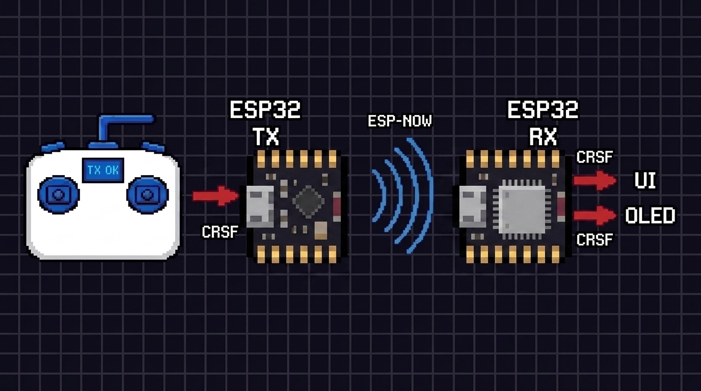

# crsf-over-espnow

A two-board ESP32 RC link. The transmitter plugs into a RadioMaster TX12's JR module bay, decodes CRSF, and relays all 16 channels over ESP-NOW. The receiver recovers them and sends link telemetry — real RSSI and link quality — back to the handset's native telemetry page.



```
                    ┌──────────────── LINK_STATISTICS (0x14) ────────────────┐
                    │                    RSSI / LQ measured at the receiver  │
                    v                                                        │
  TX12 handset ──CRSF──> ESP32 "TX" ──────── ESP-NOW ────────> ESP32 "RX" ───┘
             one wire, inverted,          16 channels @ 100 Hz
              half-duplex, 400k
```

Both boards run a serial command console. Every setting is stored in flash and survives reboot.

---

## Status

| | |
|---|---|
| ✅ Working | CRSF decode, 16-channel relay, RSSI/LQ telemetry, both consoles, flash-persisted settings |
| ⚠️ Optional | OLED readout and WiFi dashboard on the receiver — diagnostics only, off by default |
| ❌ Not built | Servo/PWM/SBUS output, failsafe, encryption, binding UI — see [Not implemented](#not-implemented) |

> **The receiver does not drive anything yet.** It decodes and displays channels; it has no failsafe and no servo output. This is a working link and a diagnostic tool, not flight-ready hardware. Do not fly it.

---

## Contents

- [Hardware](#hardware)
- [Quick start](#quick-start)
- [How it works](#how-it-works)
- [Serial commands](#serial-commands)
- [Reading `stat`](#reading-stat-on-the-transmitter)
- [Troubleshooting](#troubleshooting)
- [Notes and gotchas](#notes-and-gotchas)
- [Not implemented](#not-implemented)

---

## Hardware

| | Transmitter | Receiver |
|---|---|---|
| Board | ESP32, Arduino core 3.x | ESP32, Arduino core 3.x |
| Connection | JR module bay, **bottom pin** → GPIO 4 | — |
| Display | — | *optional* SSD1306 128×64 I²C, SDA 8 / SCL 9, addr `0x3C` |

The OLED is a convenience readout, not part of the link. Everything it shows is also available over the serial console. If you don't fit one, the `display.begin()` failure is reported and the sketch carries on normally.

### Which pin

The JR bay pins, top to bottom, are `CPPM`, `HEART_BEAT`, `VBAT`/`VMAIN`, `GND`, `SPort`. **Use the bottom pin** — the one silkscreened `SPort` on the radio. Do not use `CPPM`.

That label is historical. The pin carries S.Port telemetry when a FrSky module is fitted, but EdgeTX drives **CRSF** on the same pin when External RF is set to CRSF. Commercial Crossfire and ELRS modules label the matching pin `CRSF Serial Port`.

The CRSF line is a **single bidirectional wire**. Receiving channels needs only that wire; sending telemetry back uses the *same* wire in half-duplex mode, so no extra wiring is required. S.Port and CRSF share the same electrical topology — single-wire, inverted, half-duplex — which is why one pin serves either protocol.

### Libraries

- `Adafruit_GFX`, `Adafruit_SSD1306` — receiver only, and only if you fit the OLED
- Everything else ships with the ESP32 core: `WiFi`, `esp_now`, `esp_wifi`, `Preferences`, `driver/uart`, `WebServer`, `Wire`

### Repo layout

```
tx.ino       transmitter — CRSF decode, ESP-NOW send, CRSF telemetry write-back
rx.ino       receiver    — ESP-NOW receive, RSSI/LQ measurement, OLED + web UI
README.md
```

---

## Quick start

1. Flash `tx.ino` to the module-bay board, `rx.ino` to the receiver.
2. Open both serial monitors at **115200**, line ending set to **Newline**.
3. On the receiver: `mac` — copy the address.
4. On the transmitter: `peer aa:bb:cc:dd:ee:ff` with that address.
5. On the TX12: Model Setup → External RF → **CRSF**, baud **400K**.
6. On the transmitter: `stat` should show `rc=` and `ack=` both climbing.

Telemetry to the handset is **off by default**. Once the basic link is up, enable it with `telem on`, then on the TX12 go to the Telemetry page → **Discover new sensors**. You should get `1RSS`, `2RSS`, `RQly`, `RSNR`, `TPWR`, `RFMD`, `TRSS`, `TQly`.

---

## How it works

### Uplink (TX → RX)

The transmitter parses CRSF frames from the handset. Only `RC_CHANNELS_PACKED` (type `0x16`, length 24) is used: 16 channels × 11 bits = 176 bits = 22 payload bytes, unpacked LSB-first.

```c
typedef struct {
  uint16_t ch[16];    // raw CRSF units, 172..1811
  uint32_t frames;    // incrementing counter, used for loss detection
  uint32_t ms;        // sender millis()
} RcPacket;           // 40 bytes
```

Sending is **rate-limited** (default 100 Hz) rather than one packet per CRSF frame. CRSF runs at up to 250–500 Hz, which overruns the ESP-NOW send queue and shows up as `qFail`. Parsing still happens on every frame; only transmission is throttled.

### Downlink (RX → TX)

The receiver learns the transmitter's MAC from `info->src_addr` on the first packet, so the transmitter address is never hardcoded on the receiver side. Peer registration happens in `loop()`, never inside the ESP-NOW callback.

```c
typedef struct {
  uint8_t  magic;     // 0x7E
  uint8_t  telemHz;
  int8_t   rssi;      // uplink RSSI measured at the receiver, dBm
  uint8_t  lq;        // uplink link quality, 0-100
  uint32_t rxFrames;
  uint32_t lost;
  uint32_t uptime;    // seconds
  uint16_t vbat;      // mV, 0 = not measured
} TelemPacket;        // 20 bytes
```

The two directions are told apart by struct size (40 vs 20) plus the magic byte.

**Link quality is a real measurement, not an estimate.** The receiver compares the gap in the transmitter's `frames` counter against how many packets it actually received, over a 500 ms window. **RSSI** comes from `info->rx_ctrl->rssi` on the receiving side — the transmitter cannot measure this itself, which is the entire reason the downlink exists.

### Telemetry to the handset

With `telem on`, the transmitter writes CRSF frames back up the bay wire:

- **`0x14` LINK_STATISTICS** — every `linkMs` (default 100 ms). Uplink RSSI/LQ come from the receiver; downlink RSSI/LQ are measured locally from the telemetry packets. SNR is sent as 0 because ESP-NOW does not expose one, so `RSNR` reading 0 on the handset is expected.
- **`0x29` DEVICE_INFO** — sent in reply to the handset's `0x28` DEVICE_PING, so the radio stops discovery polling.

Frames are transmitted only in the gap immediately after a received frame, never mid-frame.

---

## Serial commands

Both boards: **115200 baud, Newline line ending**. `help` lists everything. Settings are written to flash automatically by any command that changes one.

### Transmitter

| Command | Effect |
|---|---|
| `stat` | counters and full config |
| `link` | telemetry received from the receiver |
| `ch` | dump all 16 channels once |
| `raw` | hex dump the next 64 CRSF bytes |
| `baud <n>` | CRSF baud — 400000, 420000 (ELRS), 921600, 115200 |
| `inv on\|off` | CRSF inverted serial |
| `telem on\|off` | link stats to handset (half-duplex on the CRSF pin) |
| `linkms <20-1000>` | link stats interval |
| `rate <0-500>` | ESP-NOW send Hz, 0 = every frame |
| `peer <MAC>` | target receiver, `aa:bb:cc:dd:ee:ff` |
| `bcast` | target broadcast |
| `chan <1-13>` | WiFi channel — must match the receiver |
| `log on\|off\|<ms>` | periodic channel dump, 5–5000 ms |
| `sbaud <n>` | console baud (reconnect the monitor after) |
| `mac` `zero` `defaults` `reboot` | |

### Receiver

| Command | Effect |
|---|---|
| `stat` | link status and settings |
| `link` | RSSI, LQ, lost count, learned TX MAC |
| `ch` | dump all 16 channels once |
| `web on\|off` | WiFi AP + HTTP dashboard at `192.168.4.1` |
| `chan <1-13>` | WiFi channel — must match the transmitter |
| `telem off\|<hz>` | telemetry rate back to the transmitter, 1–50 Hz |
| `log on\|off\|<ms>` | periodic channel dump, 5–5000 ms |
| `sbaud <n>` | console baud (reconnect the monitor after) |
| `mac` `defaults` `reboot` | |

`defaults` wipes saved settings and reboots. It is the recovery path whenever a stored setting leaves a board unusable.

---

## Reading `stat` on the transmitter

```
[STAT] in=1196029 synced=195427 rc=45012 ping=12 crcFail=0 q=44800 qFail=0 ack=44780 noAck=20 | ...
```

| Field | Meaning |
|---|---|
| `in` | raw bytes off the CRSF UART |
| `synced` | complete frames of any type |
| `rc` | valid channel frames (type `0x16`) — **the one that matters** |
| `ping` | DEVICE_PING frames from the radio |
| `crcFail` | channel frames that failed CRC |
| `q` / `qFail` | `esp_now_send()` **queueing** result, not delivery |
| `ack` / `noAck` | real MAC-layer acknowledgements from the send callback |

`ack`/`noAck` is your true link health. `q` succeeding only means the packet was queued. Broadcast is never acknowledged, so `bcast` always reports success.

A healthy stream is roughly **one frame per 26 bytes**. A much smaller ratio means the frames are short or malformed.

---

## Troubleshooting

**`in` stays at 0** — nothing arriving on the CRSF pin. Check wiring, `inv`, and `baud`.

**`in` climbs but `rc` stays 0** — bytes arrive but no valid channel frames. Run `raw` and look at the bytes.

**`raw` shows `C8 04 28 00 EA 54` repeating** — the radio is sending only DEVICE_PING and no channels; it is stuck in discovery. Dismiss any throttle or switch warning on the handset, confirm External RF is on and set to CRSF, exit any module config page, and power-cycle the TX12. With `telem on`, the DEVICE_INFO reply prevents this.

**`raw` shows junk** — baud or inversion mismatch. Try `baud 400000`, `baud 420000`, `baud 921600`, and `inv off`. Run `zero` between attempts so the counters stay readable.

**`qFail` climbing** — the ESP-NOW send queue is overrunning. Lower `rate`.

**`ack` low, `noAck` high** — packets sent but not acknowledged. Check the peer MAC matches the receiver's `mac`, and that `chan` is identical on both boards. `bcast` skips MAC matching and is a fast way to prove the CRSF side is healthy.

**Receiver shows `frames=0`** — the transmitter never sent anything. Check `rc` on the transmitter first; if it is 0, the problem is CRSF, not ESP-NOW.

**Transmitter hangs right after the boot line** — `applyUart()` failed while setting up half-duplex. The staged prints (`begin...`, `set_pin=`, `set_mode=`) show which call. Because `telem` is stored in flash, a board that hangs will hang on *every* boot: add `crsfTelem = false;` immediately after `loadSettings()`, flash, run `defaults`, then remove the line.

**Corruption once `telem on`** — bus contention on the shared wire. Make the CRSF pin open-drain with a pull-up, or fall back to `telem off`.

**Channels 9–16 frozen** — usually the handset, not the link. Most radios map only the first 8 or 12 channels by default and park the rest at centre (992) or low (172).

---

## Notes and gotchas

**WiFi channel.** `softAP()` pins the radio to a channel and can silently drag one board away from the other. `startWeb()` pins the AP to the configured channel and `stopWeb()` forces the radio back, so `web on`/`web off` will not kill the link. Watch the `[WIFI] channel=` line if something breaks after toggling.

**The web UI costs airtime.** The dashboard polls every 100 ms and shares the radio with ESP-NOW. Leave it off when you aren't using it.

**Serial bandwidth.** A channel dump line is ~86 bytes; at 115200 that is ~7.5 ms of blocking transmit. Below ~15 ms intervals the console saturates and starts stalling the loop. Use `sbaud 921600` on both ends for faster dumps.

**OLED timing.** A full 128×64 I²C frame is ~1 KB. `Wire.setClock(400000)` cuts the blocking transfer from ~25 ms to ~7 ms.

**Dump rate vs send rate.** The receiver cannot show data faster than the transmitter sends it. `log 10` (100 Hz) against `rate 100` matches; anything faster just reprints identical values.

**NVS namespaces** are `rctx` and `rcrx`, so the two sketches never collide if a board is reflashed with the other firmware. All loaded values are range-checked, and the peer MAC falls back to the compiled default unless exactly 6 bytes are read back.

**Send callback signature** differs between ESP-IDF versions and is handled with an `ESP_IDF_VERSION` guard. If it fails to compile, that guard is the first place to look.

---

## Not implemented

Listed so nobody assumes otherwise:

- **No servo or PWM output.** The receiver decodes channels but drives no pins.
- **No SBUS/CRSF output** to a flight controller.
- **No failsafe.** On link loss the receiver holds the last received values indefinitely. `age` and the `NO LINK` indicator report the condition but nothing acts on it.
- **No encryption.** ESP-NOW peers are unencrypted; anyone on the channel can inject a correctly sized packet.
- **No binding procedure.** Pairing is manual via the `peer` command.
- **Uplink SNR is not reported** — ESP-NOW does not expose it, so `RSNR` is always 0.

---

## Channel value reference

| CRSF raw | Microseconds | Position |
|---|---|---|
| 172 | 988 | low endpoint |
| 992 | 1500 | centre |
| 1811 | 2012 | high endpoint |